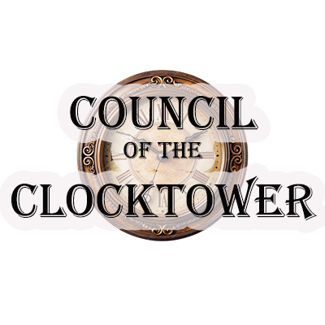

<div align="center">
  
</div>

# Förklaring av Regler

You are about to receive either a red or blue token. If blue, you are good. If red, you are evil. The aim of the game if you are good is to find and execute the Demon. If the Demon dies, good wins. The aim of the game if you are evil is to destroy the town. If just two players are left alive, evil wins.

The game is split into two phases: a day phase and a night phase. During the day, you talk. You will each have a secret identity, a character on the list. Generally, the good players share whatever they know and attempt to find out who is who. Most good players will be telling the truth, but some have an incentive to lie. If you are evil, you should definitely be lying! It is best to pick a good character to pretend to be, spreading as much false information as possible.

During the night, everybody closes their eyes. I will wake some players so that they can use their ability or gain some type of information. At night, I will be silent, but communicate using hand signals.

2 taps on your shoulder or your knee means EYES OPEN
This means EYES CLOSED
This means YES and this means NO
This means GOOD and this means EVIL
This means 0, 1, 2, 3 and so on

Most of you will die. This is a good thing! In Ravenswood Bluff, death is not the end. Some players may even want to die, as they gain information when they do. If you are dead, you still participate in the game, you may still talk, and you still win or lose when your team wins or loses.

There is a lot of information in this game. However, some of it might be wrong. If you are drunk or poisoned, you have no ability, but I will pretend that you do. I am allowed to lie to you—any information that you get may be incorrect, but you will not know if you are drunk or poisoned. For example, if you are the Drunk, you drew a different character token out of the bag and only I know that you are actually the Drunk. Or, if the Poisoner poisons you, you may still wake at night to use your ability, but it won’t work. 

## FOUR RULES
This can be a lot of information to take in at once, so to keep things simple, there are only four things you need to remember:

1) You may say whatever you want at any time. This is a talking game. You can talk publicly with the group or have private conversations, it is up to you.

2) No peeking. Please keep your character token a secret, and never look into the Grimoire, as it contains all the game characters. If you see something you shouldn’t, it will spoil the fun.

3) Ask me any questions you need to. If you get confused, or don’t understand how your character works, or don’t understand how the character that you are pretending to be works, or if something happens at night that you don’t understand, or you just need some strategy advice... whatever it is, please ask. I’m neutral, and my job is to help you understand the rules and have fun playing. Let me know when you have a question, and we can talk in private so that nobody knows what question you asked.

4) Play nice. This is a game about deception and trickery, so please treat others with respect and consideration. Kill with grace, and die with dignity.

## BEFORE THE FIRST NOMINATION
I am about to call for nominations. To nominate a player, simply say who. For example: “I nominate Bob.” When a player is nominated, everyone votes on whether or not to execute them. For example: I will put my arm out like this (point to Bob), and say “Votes for Bob, starting now.” I move my hand in a clockwise direction (demonstrate this) and if your hand is up when I get to you, that’s a vote, and if your hand is down, that’s not a vote.

Each day, you may vote for as few or as many players as you wish, and whoever has the most votes is executed. This player needs a vote tally of at least 50% of the living players or no execution occurs. On a tie, neither player is executed.

If you die, you are still a major part of the game. You still talk, and you still close your eyes during the night time. Most importantly, you still win or lose with your team. In fact, the game is usually decided by the votes and opinions of the dead players. When you die, you lose your character ability, you may no longer nominate, and you have only one vote for the rest of the game, so use it wisely. 
> :warning: **This project is no longer actively maintained** and will only receive critical bug fixes and the remaining Kickstarter preview roles. :warning:


This is an unofficial online tool to run Blood on the Clocktower games through Discord or other digital means.
It is supposed to aid storytellers and players by allowing them to quickly set up games, run votes and much more.


If you want to learn more about how to use the app as a player, kindly created two tutorial videos.

### How to host a game


### How to play a game


## Features

- Public Town Square and Storyteller Grimoire (toggle with **shortcut \[G\]**)
- Supports custom script JSON generated by the [Script Tool](https://bloodontheclocktower.com/script)
- Live Session for Storyteller / Players including live voting and character distribution!
- Includes all 3 base editions, Travelers and Fabled plus all officially spoiled characters so far!
- Night sheet and reminder text for each character ability to help storytellers
- Full homebrew support for hosting and playing games with your own sets of characters
- Many other customization options!

### Custom Script Support

Any custom script generated by the official [Script Tool](https://script.bloodontheclocktower.com/) is supported out of
the box and you only need to upload it to get the selected set of characters into your grimoire. If you want to customize
your script further, there is an additional `"_meta"` object that you can add to the script like you would add a normal
character:

```json
[
  {
    "id": "_meta",
    "name": "Deadly Penance Day",
    "author": "TPI",
    "logo": "https://url.to/your/logo.png"
  }
]
```

This will provide your local Grimoire (and those of your live session players) with more information to show about
your custom script - instead of "Custom Script" it would show "Deadly Penance Day" on the character reference sheet,
for example. The logo will be shown to your players after they have enabled custom images in the Grimoire menu.

### Custom Character Support

In order to add custom characters to your local Grimoire, you need to create a JSON definition for them,
similar to what is provided in the [`roles.json`](https://github.com/bra1n/townsquare/blob/main/src/roles.json) for the 3 base editions. Here's an example of how such a character
definition file might be written:

```json
[
  {
    "id": "acrobat",
    "image": "https://github.com/bra1n/townsquare/blob/main/src/assets/icons/acrobat.png?raw=true",
    "edition": "custom",
    "firstNight": 0,
    "firstNightReminder": "",
    "otherNight": 49,
    "otherNightReminder": "If either good living neighbor is drunk or poisoned, the Acrobat dies.",
    "reminders": ["Die"],
    "remindersGlobal": [],
    "setup": false,
    "name": "Acrobat",
    "team": "outsider",
    "ability": "Each night*, if either good living neighbor is drunk or poisoned, you die."
  },
  {
    "id": "investigator"
  },
  {
    "id": "imp"
  }
]
```

This definition JSON includes a custom character, the Acrobat, and 2 base game characters, the Investigator and the Imp.
For base game characters, it is sufficient to only provide the ID, similar to what you get from the Script Tool.

**Required properties:** `id`, `name`, `team`, `ability`

- **id**: the internal ID for this character, without spaces or special characters<br>
  _Note_: this ID needs to be unique and can't be the same as any ID already used by an existing character, otherwise the custom character will be overwritten with the existing role!
- **image**: a URL to a PNG of the character token icon (should have a transparent background!)<br>
  _Note_: custom images will only be visible after enabling them in the Grimoire menu!
- **edition**: the ID of the edition for this character. can be left blank or "custom"
- **firstNight** / **otherNight**: the position that this character acts on the first / other nights, compared to all
  other characters<br>
  _Note_: must be a positive number or zero, with zero being treated as "does not act during the night"
- **firstNightReminder** / **otherNightReminder**: reminder text for first / other nights
- **reminders**: reminder tokens, should be an empty array `[]` if none
- **remindersGlobal**: global reminder tokens that will always be available, no matter if the character is assigned to a player or not
- **setup**: whether this token affects setup (orange leaf), like the Drunk or Baron
- **name**: the displayed name of this character
- **team**: the team of the character, has to be one of `townsfolk`, `outsider`, `minion`, `demon`, `traveler` or `fabled`<br>
  _Note_: if you create a custom Fabled character, it will be automatically added to the game when the custom script is loaded
- **ability**: the displayed ability text of the character

## [Code of Conduct](CODE_OF_CONDUCT.md)

## [Contributing](CONTRIBUTING.md)

## Acknowledgements and Copyrights

- [Blood on the Clocktower](https://bloodontheclocktower.com/) is a trademark of Steven Medway and [The Pandemonium Institute](https://www.thepandemoniuminstitute.com/)
- Night reminders and other auxiliary text written by [Ben Finney](http://bignose.whitetree.org/projects/botc/diy/)
- Iconography by [Font Awesome](https://fontawesome.com/)
- Background image copyright and permission granted by [Ryan Maloney](https://www.artstation.com/maloney94)
- Webfonts by [Google Fonts](https://fonts.google.com/) and [Online Web Fonts](https://www.onlinewebfonts.com/)
- All other images and icons are copyright to their respective owners

This project and its website are provided free of charge and not affiliated with The Pandemonium Institute in any way.

## Donations

This project will always be available free of charge, since I love building cool things and playing Blood on the Clocktower. If you still want to support me with a donation, you can do that here:


# Development

npm run dev

# Deployment

## Automated Deployment

This project uses GitHub Actions for automated CI/CD. When you push to the `main` branch:

1. **Linting**: Code is automatically linted to ensure quality
2. **Build**: Project is built using `npm run build`
3. **Deploy**: Built files are automatically deployed to GitHub Pages

The site will be available at: `https://robhjoh.github.io/sitt/`

## Manual Deployment

If you need to deploy manually:

```bash
npm run build
# Upload dist/ folder to gh-pages branch
```
